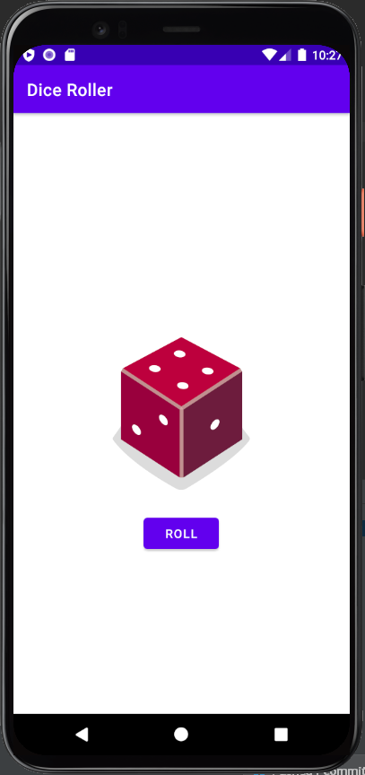

# Dice roller

Kotlinを用いたAndroidアプリ。
中央下の`Roll`ボタンを押すとサイコロが振られ、中央上のサイコロの画像がランダムに変化する。

サイコロ画像は、google-developer-trainingの [リポジトリ](https://github.com/google-developer-training/android-basics-kotlin-dice-roller-with-images-app-solution/) から。
